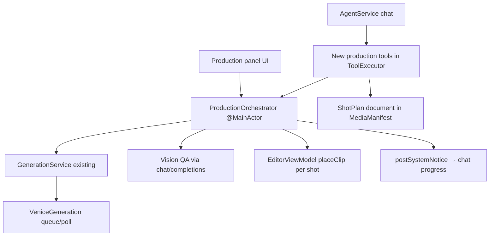

# Native Harness Port — Agent-Driven Video Production

## Goal

Make the in-app agent work as the harness in real time: "regenerate shot 7 and update the timeline", or "here's my 3-min video idea — brainstorm, storyboard, then generate and stitch". The agent does the batching and bulk work; shots land on the timeline one by one after QA so the human can fine-tune during or after background generation. Everything surfaces both as agent tools and UI.

## What we build on (already exists)

- Agent stack: `AgentService` loop, 55 tools in `ToolExecutor+*.swift`, fire-and-forget generation returning placeholder assets, `get_media` readiness polling
- Venice layer: `VeniceGeneration.swift` (queue/poll/resume), `VideoModelCapabilities.swift` (harness-synced allowlists), cost quotes, silent-reject guard, Seedance consent
- Timeline: `editor.placeClip(...)`, `placeGeneratingAudioClip` / `finalizeGeneratingClip` (placeholder-clip-then-resolve pattern)
- Persistence: `MediaManifest` (version-safe to extend), `ProjectDocument` for markdown docs
- Existing tools: `extract_last_frame` (frame chaining primitive), `inspect_media` (vision QA primitive), `generate_audio` (TTS/music)

## Architecture

Key decision: a native `ProductionOrchestrator` (per-editor, like `GenerationService`) owns the background shot loop — the agent kicks it off and stays free to chat; the orchestrator generates shots sequentially/concurrently, runs QA, places clips, and reports progress into chat via `postSystemNotice` and into the UI via a production panel.

## Phase 1 — Shot plan model + persistence

- New `Sources/VeniceVideoCreator/Production/ShotPlan.swift`: typed `ShotPlan` (title, aspect, resolution, defaults) with `Shot` entries — id, description/prompt, duration, motion level, dialogue, transition, model override, character refs, status (`planned / storyboarded / generating / qa / approved / placed / failed`), storyboard asset id, video asset id, take history
- Store as a new optional field on `MediaManifest` (decoder tolerates missing keys) + mirror a human-readable markdown `ProjectDocument` so users see the plan in the Documents tab
- Character model: `CharacterSpec` (name, reference image asset ids, locked voice id, provenance) stored alongside the plan
- Agent tools: `save_shot_plan`, `get_shot_plan`, `update_shots` (edit/insert/remove/reorder shots); brainstorming itself is just chat — the plan is the artifact

## Phase 2 — Storyboard + character pipeline

- Port the character workflow: `create_character` tool → generate front/three-quarter reference images (existing image gen path), tag assets with character id in manifest; `audition_voices` → N TTS samples via existing audio path; `lock_voice`
- Provenance sidecars (port `provenance.ts`): record `generationModel`/`editModels`/`hasFace` per generated image in `MediaManifestEntry` (the `GenerationInput` provenance already stored gets extended) — needed for the Seedance face-provenance gate
- `storyboard_shots` tool: per-shot panel via image gen (reference-augmented when characters present), optional multi-edit refine pass; panels linked to shots, shown in the production panel
- Vision QA (port harness two-pass QA): `qa_shot` runs `/chat/completions` with panel/video frames + rubric via a new `VisionQA.swift`; results annotate the shot; `fix_panel` = multi-edit correction
- Approval gates are conversational + UI: shot statuses flip to `approved` via `update_shots` or a button in the panel

## Phase 3 — ProductionOrchestrator (the core)

- New `Production/ProductionOrchestrator.swift` (@MainActor, per editor, mirroring `GenerationService` lifecycle: detach on close, resume on reopen from persisted shot statuses)
- `produceShots(ids:)` loop per shot: quote cost → route model (port `resolveVideoFamilyDefaults` + routing defaults: lip-sync → Wan 2.7, character consistency → Seedance R2V) → submit via existing `VideoGenerationSubmission` → await completion (use the existing `onQueued`/`onComplete` submission hooks — this is where the in-flight uncommitted batching work pays off) → optional auto-QA → place clip at the shot's timeline slot (`placeGeneratingClip` pattern extended to video) → next shot
- Port the Seedance→Wan keyframe lip-sync pipeline as a shot strategy: Stage A R2V render (no audio) → extract frame 1 (`LastFrameExtractor` generalized to frame N) → Stage C Wan 2.7 i2v with keyframe + padded `audio_url` (audio padding already exists)
- Frame chaining between shots: transition types (DISSOLVE/MATCH CUT) trigger last-frame extraction feeding the next shot's start image
- Error handling ports: retry-with-delay per shot, Seedance 409 consent resubmit (exists), silent-reject retry hook, per-shot failure marks status `failed` without killing the run
- Progress: orchestrator publishes `@Observable` run state (current shot, N of M, per-shot status) + `postSystemNotice` into the active chat on shot completion/failure so the agent and user both see it
- `regenerate_shot` tool: re-runs one shot (new take appended to take history), replaces its timeline clip in place — the "regenerate shot 7" flow

## Phase 4 — Audio layers + assembly

- `produce_audio` stage: per-shot dialogue TTS (locked character voices), music bed, ambient bed — reusing existing audio generation + `placeGeneratingAudioClip`, placed on dedicated named audio tracks (dialogue / SFX / music) like the harness 4-lane layout
- Voice routing is three-tier (harness `b137102`, 2026-07-17): sync TTS (Kokoro/Qwen3) for cheap dialogue, **Seed Audio 1.0 (`seed-audio-1-0`)** for premium prompt-directed narration/VO via the async audio queue (25 named voices, default `"Describe in prompt"`, speed 0.5–2, 2048-char prompt cap, mp3/wav, ~$0.0029/s), ElevenLabs where already wired
- Mirror the harness `MusicModelSpec` capability metadata (voices, speed bounds, prompt length bounds, formats, per-second pricing) into the app's `AudioModelConfig` so `generate_audio` and the generation panel validate pre-flight instead of eating paid 400s; add the new registry entries (`seed-audio-1-0`, `minimax-music-v25`, `minimax-music-v26`, `lyria-3-pro`)
- V.O. prompt rules (harness `03a17f4`, 2026-07-17) in the shot prompt builder: NARRATOR/V.O./VO dialogue lines never reach the video prompt (they cause Seedance to synthesize a competing narrator) — append "No narration, no voice-over, no spoken words in this shot." instead; keep model audio ON for ambient/SFX on VO shots (only `suppressModelNarration` global opt-in or per-shot `nativeAudio: mute` disables it); the VO line still drives the TTS pass
- Native-audio handling per shot: volume/duck/mute flags on the shot model applied to placed clips; shot dialogue carries a narrator/VO flag
- Stitching is the timeline itself — no ffmpeg concat needed; transitions become timeline transitions/overlaps; final export via existing `ExportService` (loudness normalization: check what export already does, add loudnorm pass if missing)
- Subtitles: existing captions + transcription path wired as a `generate_captions_for_production` step

## Phase 5 — Production panel UI

- New `Production/UI/ProductionPanel.swift`: shot list with storyboard thumbnails, per-shot status badges, cost column (quote per shot + running total), approve/regenerate/QA buttons, run controls (start/pause/cancel)
- All styling via `AppTheme`; drop targets (if any) follow the AppKit drop rule
- The panel and the agent operate on the same `ShotPlan` + orchestrator state, so "both surfaces" is automatic

## Sync obligations (workspace rule)

- Any capability learned/changed while porting (e.g. new `perReferenceAudio`, `videoInput`, prompt-length caps from `models.ts`) must be reflected in BOTH `VideoModelCapabilities.swift` and the harness `~/Projects/video-proj/venice-video-harness/src/venice/models.ts`, with probe dates in comments
- Extend `VideoModelCapabilities` with the harness fields the app lacks: `supportsElements`, `supportsSceneImages`, `perReferenceAudio` — conservative defaults off
- Quote-before-queue becomes standard in the orchestrator (harness underuses it; the app should not)

## Deliberately deferred

- **Seedance→Wan keyframe lip-sync pipeline** (2026-07-17 audit): the Stage A R2V render →
  frame extract → Stage C Wan 2.7 i2v + padded `audio_url` shot strategy was not built in the
  initial port. The building blocks all exist (`LastFrameExtractor.pngData(url:atSeconds:)`,
  `AudioSilencePadder` + `minAudioInputSeconds` in `VideoGenerationSubmission`,
  `audioInputCapable` in `VideoModelCapabilities`), but no orchestrator stage chains them and
  the router has no lip-sync route. Deferred until the basic produce loop has real-world mileage;
  when built, it should be a `ShotStrategy` the router picks when a shot has dialogue with
  `voiceOver == false` and a character with a locked voice.
- Explicit family-default routing port (`resolveVideoFamilyDefaults`): current routing is
  generic capability-based; Seedance R2V wins character-consistency shots only because
  SupplementalModels orders it first. Fine for now, revisit with the lip-sync strategy.
- `elements[]` request builder (Kling O3 / Wan 2.7 R2V per-element audio) — phase 2 of routing, after the basic pipeline works
- Cross-project asset library, EDL/text-based editing pipeline, NLE timeline export additions (app already has FCPXML export)
- Whisper-based cut-qa self-eval
- Phase 4 remainder: dedicated named dialogue/SFX/music timeline lanes, applying per-shot
  `nativeAudio` duck/volume to placed clips, a real `generate_captions_for_production` step
  (today the produce_audio hint points at `add_captions`), export loudness normalization check.
- Phase 5 remainder: per-shot cost quote column in the panel (running total only today).

## Open item

~~The uncommitted batching changes (`onQueued` plumbing, `SupplementalModels.swift`, Count picker) should be committed first — the orchestrator builds directly on `onQueued`.~~ Done (`505e068`). Note the orchestrator ended up awaiting `onComplete` only; `onQueued` is used by the generation panel's sequential batching.

## Post-port fixes (2026-07-17 audit)

- Provenance: edit paths (`submitImageEdit`, background-remove, upscale — covering `edit_image` and `fix_panel`) now carry `hasFace` forward and append to `editModels`, so the Seedance face-provenance gate sees post-edit lineage.
- `save_shot_plan` no longer wipes characters when the `characters` key is omitted on a re-save.
- Duplicate shot ids are rejected on save/insert; the reorder/merge dictionaries no longer trap on duplicates.
- Orchestrator `resume(editor:)` reconciles stuck `generating`/`qa` shots: places finished assets, watches still-recovering generations, and fails shots whose asset is gone or settled unusable.